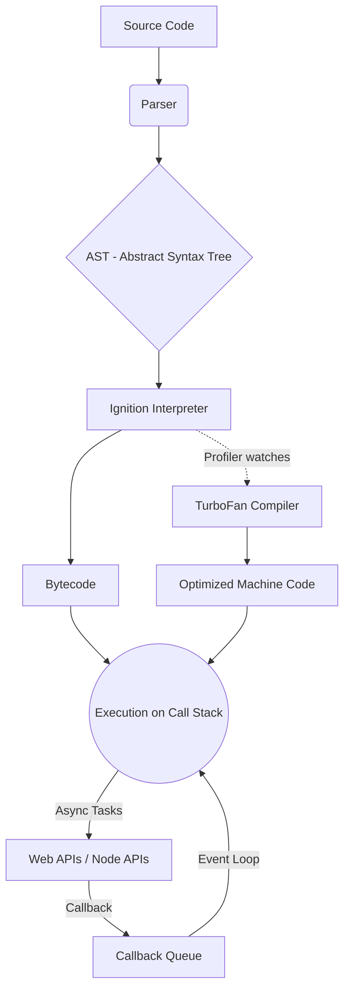

# How JavaScript Execution Happens

JavaScript is a high-level, interpreted, single-threaded programming language. When we run JavaScript code, the environment (like a web browser or Node.js) relies on a **JavaScript Engine** to parse, compile, and execute the code. 

The most famous engine is the **V8 Engine**, developed by Google (used in Google Chrome and Node.js).

---

## 1. The V8 Engine Overview
The V8 Engine is responsible for converting your human-readable JavaScript code into machine code that the computer's processor can understand and execute extremely fast.

It consists of two primary memory components:
- **Memory Heap**: This is where memory allocation happens. It is a large, mostly unstructured region of memory where variables, objects, arrays, and functions are stored.
- **Call Stack**: This is a data structure that keeps track of the execution context. It records where we are in the program. If we step into a function, we push it onto the stack. If we return from a function, we pop it off the top of the stack.

---

## 2. The Execution Process

When you run JavaScript code, the engine performs the following steps:

### A. Parsing (Lexical Analysis)
The engine reads the source code and breaks it down into "tokens" (keywords, operators, variable names). These tokens are then structured into an **Abstract Syntax Tree (AST)**, which is a tree-like representation of the code's grammatical structure.

### B. Just-In-Time (JIT) Compilation (Ignition & TurboFan)
Modern JavaScript engines like V8 use a **Just-In-Time (JIT) Compilation** approach. It combines the fast startup of an interpreter with the high performance of a compiler.

1. **Ignition (Interpreter)**: The AST is passed to the Ignition interpreter, which generates unoptimized bytecode and starts executing it immediately. This ensures the code starts running as fast as possible.
2. **TurboFan (Optimizing Compiler)**: While the bytecode is running, a profiler watches the code for "hot" functions (code that is executed repeatedly). TurboFan takes these hot pieces of bytecode, optimizes them, and compiles them directly into highly optimized machine code. If the optimization assumptions turn out to be wrong later, it can "de-optimize" back to bytecode.

### C. Execution Context & The Call Stack
JavaScript is **single-threaded**, meaning it has only one Call Stack and can only do one thing at a time.
As the code is executed:
- A Global Execution Context is created and pushed onto the Call Stack.
- Whenever a function is invoked, a new Function Execution Context is created and pushed to the top of the Call Stack.
- Once the function finishes executing, it is popped off the stack, and control returns to the context below it.

---

## 3. Handling Asynchronous Code (The Runtime Environment)
Because JavaScript has only one Call Stack, a heavy computation or a slow network request would block the thread, freezing the page. To prevent this, JavaScript uses asynchronous features provided by its environment (Browser or Node.js).

This involves three extra pieces outside the V8 engine:

1. **Web APIs (or C++ APIs in Node)**: When an asynchronous operation (like `setTimeout`, `fetch`, or DOM events) is encountered, the V8 engine offloads it to the Web APIs. The Call Stack is immediately freed to continue executing the rest of the code.
2. **Callback Queue (Task Queue)**: Once the background operation (e.g., the timer finishes or the API response arrives) is complete, its callback function is pushed into the Callback Queue.
3. **Event Loop**: The Event Loop's only job is to constantly look at the Call Stack and the Callback Queue. If the Call Stack is **empty**, it takes the first task from the Callback Queue and pushes it onto the Call Stack to be executed.

### Summary Flow Diagram

#### Diagram Explanation:
- **Source Code**: The raw JavaScript code you write.
- **Parser**: Performs lexical analysis, reading the code and breaking it down into manageable tokens.
- **AST (Abstract Syntax Tree)**: The structured, tree-like representation of your code's grammar.
- **Ignition Interpreter**: Quickly converts the AST into unoptimized bytecode to start execution as fast as possible.
- **Bytecode**: The initial executable code that runs on the Call Stack.
- **TurboFan Compiler**: Runs in the background and watches for "hot" code. It optimizes this code and converts it directly into machine code for maximum performance.
- **Execution on Call Stack**: The main thread where synchronous JavaScript code executes, one line at a time.
- **Web APIs / Node APIs**: The environment APIs that handle asynchronous operations (e.g., `fetch`, `setTimeout`) outside the V8 engine.
- **Callback Queue**: A waiting area that holds async callbacks that have finished running in the Web APIs and are ready to be executed.
- **Event Loop**: The mechanism that continuously checks if the Call Stack is empty. If it is, it pushes the first task from the Callback Queue onto the Call Stack.

---

## Sources of Information
- [V8 Engine Documentation (v8.dev)](https://v8.dev/)
- [MDN Web Docs - How JavaScript works](https://developer.mozilla.org/en-US/docs/Web/JavaScript/Event_loop)
- [Node.js Architecture & Event Loop](https://nodejs.org/en/docs/guides/event-loop-timers-and-nexttick/)
